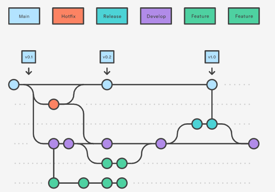

# Metodologia

Segue apresentado a metodologia com as definições sobre os ambientes de trabalho utilizados pela equipe para desenvolver o projeto. Inclui a gestão do código fonte, além da definição do processo e ferramentas através dos quais a equipe se organiza para gestão do projeto.

## Gestão de Controle de Versão

A ferramenta de controle de versão escolhida para o projeto foi o Git, com o GitHub tendo sido escolhido para a hospedagem do repositório. O fluxo de trabalho do Git escolhido para o o projeto foi o Gitflow, que consiste em um modelo de organização e gerenciamento de ramificações (branches) do Git. Dentro do Gitflow, todo o desenvolvimento e manutenções no código são realizados em branches separadas, sendo elas:
     
- `main`: branch criada no início de projeto que deve conter apenas código pronto para lançamento, deve-se realizar (direta ou indiretamente) o merge de todas as outras branches à main branch quando estas houverem sido suficientemente testadas e consideradas concluídas.
- `develop`: branch criada a partir da main branch no início do projeto que contém novas funcionalidades recém produzidas, mas que ainda se encontram na fase de testes. É onde deve ser realizado o merge de novas funcionalidades desenvolvidas nas feature branches que já terminaram de ser progamadas mas ainda não foram testadas.
- `feature`: branches que devem ser criadas a partir da develop branch ao iniciar a implementação de uma nova funcionalidade. Ao completar a funcionalidade em questão, deve-se realizar o merge da feature branch em questão com a develop branch.    
- `release`: branch utilizada no processo de preparar um novo lançamento (release) do produto. É ramificada a partir da develop branch e deve ser utilizada apenas para a correção de bugs, melhoramentos em funcionalidades existentes e outras atividades relacionadas ao lançamento em questão (sem implementação de novas funcionalidades). Ao final do processo, deve ocorrer o merge desta branch com a main branch (marcando-se esta com o número da versão) e também com a develop branch.
- `hotfix`: branch ramificada diretamente da main branch que é utilizada para realizar modificações rápidas na main branch para lançamentos de produção. Uma vez concluída, deve-se realizar o merge tanto com a main branch (para implementação da modificação) quanto com a develop branch (para que as correções também estejam presentes no próximo release).
     
Tal modelo permitie a correção rápida de lançamentos de produção mantendo uma linha de desenvolvimento dedicada para a atualização de segurança, deixando que a equipe trabalhe com problemas sem interromper o fluxo do trabalho ou esperar o próximo ciclo de lançamento.

<b>Figura 2</b> - Fluxo de controle do código fonte no repositório github  

 

 

A gerência de issues será feita pelo próprio sistema do Github dentro do repositório do projeto, adotando-se a seguinte convenção para
etiquetas:

- `documentation`: realizar mudanças na documentação
- `bug`: reportar problemas nas funcionalidades implementadas
- `enhancement`: realizar melhorias em alguma funcionalidade
- `feature`: realizar a implementação de uma nova funcionalidade

## Gerenciamento de Projeto

### Divisão de Papéis

A equipe utiliza processos da metodologia ágil, tendo escolhido o Scrum para gestão e planejamento do projeto em questão.

A equipe está organizada da seguinte maneira:
- **Scrum Master:** Vania Maria Tiburzio Rezende
- **Product Owner:** Sergio Luiz de Menezes Filho
- **Equipe de Desenvolvimento:**
     - André Soares Alves da Silva
     - Maria Luiza Silva Lacerda
     - Robson Levi Mariano Eduardo
- **Equipe de Design:** André Vieira Grochowski

### Processo

Para organização e distribuição das tarefas do projeto, a equipe está utilizando o quadro Kanban (Trello) construído com as seguintes listas:

- **Backlog:** Essa lista é onde os itens a serem implementados do projeto são alocados em cartões individuais. A lista também reúne itens que o time pode querer trabalhar ou nos quais precisará trabalhar no futuro, mas que ainda estão sendo avaliados.
- **Backlog da Sprint:** Essa lista é onde os itens do backlog a serem trabalhados na sprint atual são alocados como tarefas a serem realizadas pelos membros da equipe.
- **Em andamento:** Quando uma tarefa tiver sido iniciada, ela é movida para cá.
- **Fase de teste:** Checagem de Qualidade. Quando a tarefa está quase concluída, é o momento de movê-la para esta lista para que seja revisada pelos membros da equipe e seja determinado se os critérios de aceitação foram atingidos.
- **Concluído:** Nesta lista são colocadas as tarefas que passaram pelos testes e controle de qualidade e estão prontos para ser entregues ao usuário. Pois já foram revisadas e aprovadas, não há mais edições ou revisões necessárias.
- **Bloqueado:** Caso venha existir tarefas que foram impedidas de serem concluídas por algum motivo, deverão ser registradas nessa lista.

O quadro Kanban do grupo no Trello está disponível através da seguinte URL:
 
https://trello.com/b/lIIiew8L/kanban-projeto-aplica%C3%A7%C3%A3o-de-comunica%C3%A7%C3%A3o-escolar
 
Este quadro é apresentado, no estado atual, na figura a seguir:

   

<b>Figura 2</b> - Tela do kanban (Trello) utilizada pelo grupo

 

Os itens são ainda, etiquetados em função da natureza da atividade e da Sprint a qual são alocados, seguindo as seguintes categorias:

- **Documentação:** Elaborar parte da documentação do projeto
- **Funcionalidade:** Implementar uma funcionalidade específica no projeto
- **Sprint:** Sprint na qual a tarefa será trabalhada
 
### Ferramentas

As ferramentas empregadas no projeto são:
- **Editor de Código:** O editor de código escolhido foi o _Visual Studio 2022_ pela integração com o Framework ASP.NET e outras ferramentas utilizadas no projeto como _GitHub_ e o _SQL Server_.
- **Sistema gerenciador de banco de dados (SGBD):** O SGBD escolhido para o projeto foi o _SQL Server_ dado sua boa integração com o editor de código e para facilitar a migração do banco de dados para o Azure nas fases mais avançadas do projeto.
- **Ferramentas de comunicação:** A ferramenta de comunicação escolhida foi o _Microsoft Teams_ dado a facilidade de comunicação, reuniões em vídeo e compartilhamento de arquivos e a criação de um ambiente de trabalho exclusivamente focado no projeto em questão.
- **Ferramentas de desenho de tela (wireframing):** A ferramenta escolhida para a elaboração dos wireframes foi o _Lucidchart_. A escolha se deu dado a sua capacidade de geração de wireframes interativos detalhados e da familiaridade dos membros da equipe com a ferramenta.
- **Ferramentas de elaboração de diagramas:** Para a elaboração dos diversos diagramas do projeto (diagramas de fluxo, diagramas de classes, modelo ER e esquema relacional), a ferramenta _Lucidchart_ foi escolhida por conta de sua versatilidade para elaboração de diagramas de diversos tipos e da familiaridade dos membros da equipe com seu uso.
- **Ferramentas de controle de versão:** Conforme descrito na seção “Controle de Versão”, a ferramenta de controle de versão escolhida foi o _Git_, cuja utilização se deu através da integração com o editor de código _Visual Studio 2022_, para a hospedagem do repositório será utilizado o _GitHub_. Essa escolha foi feita devido à robustez dessas ferramentas e a familiaridade dos membros da equipe com as elas.
- **Ferramenta de gerenciamento de projeto:** A ferramenta _Trello_ foi escolhida para a organização e distribuição das tarefas seguindo o modelo Scrum, conforme descrito na subseção “Processo” da seção “Gerenciamento de Projeto”. A ferramenta foi escolhida dada sua facilidade de uso e sua compatibilidade com a metodologia Scrum, com diversos materiais disponíveis sobre sua integração com esta.
 
### Relação de Ambientes de Trabalho
   
| Ambiente      | Plataforma                | Link de Acesso             |
|---------------|---------------------------|----------------------------|
| Repositório de Código Fonte | GitHub | https://github.com/ICEI-PUC-Minas-PMV-ADS/pmv-ads-2022-1-e2-proj-int-t2-aplicacao-de-comunicacao-escolar/blob/main/src/README.md |
| Documentação do Projeto | GitHub | https://github.com/ICEI-PUC-Minas-PMV-ADS/pmv-ads-2022-1-e2-proj-int-t2-aplicacao-de-comunicacao-escolar/tree/main/docs |
| Projeto de Interface (Wireframes) | Lucidchart | Inserir Link |
| Gerenciamento do Projeto | Trello | https://trello.com/b/lIIiew8L/kanban-projeto-aplica%C3%A7%C3%A3o-de-comunica%C3%A7%C3%A3o-escolar |

